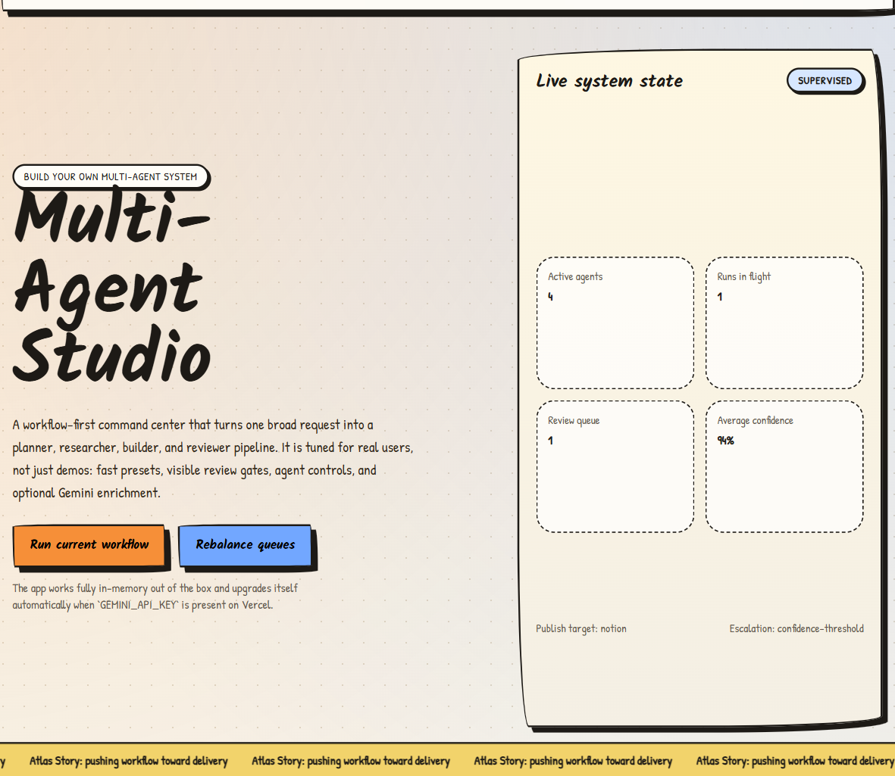
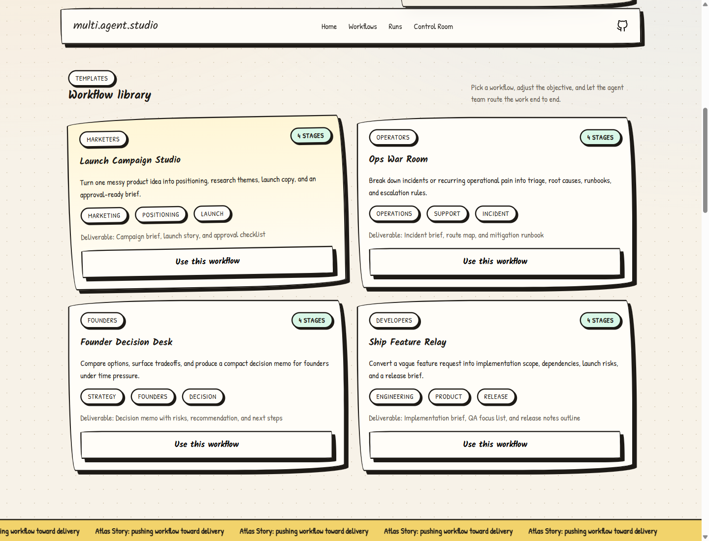
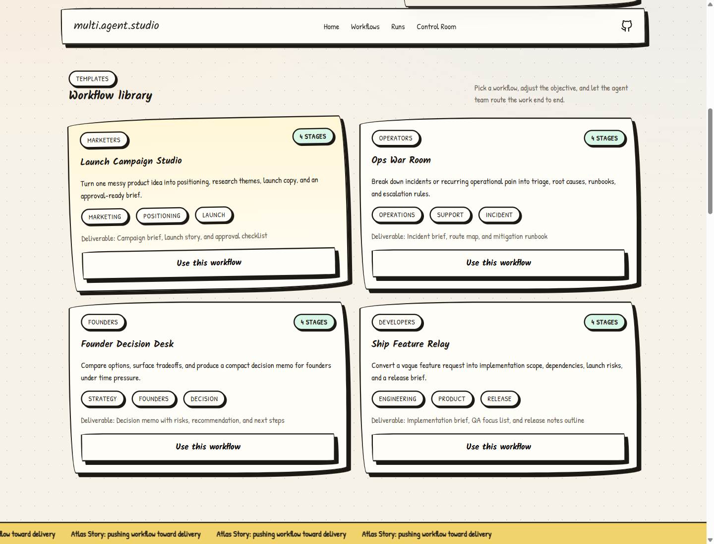
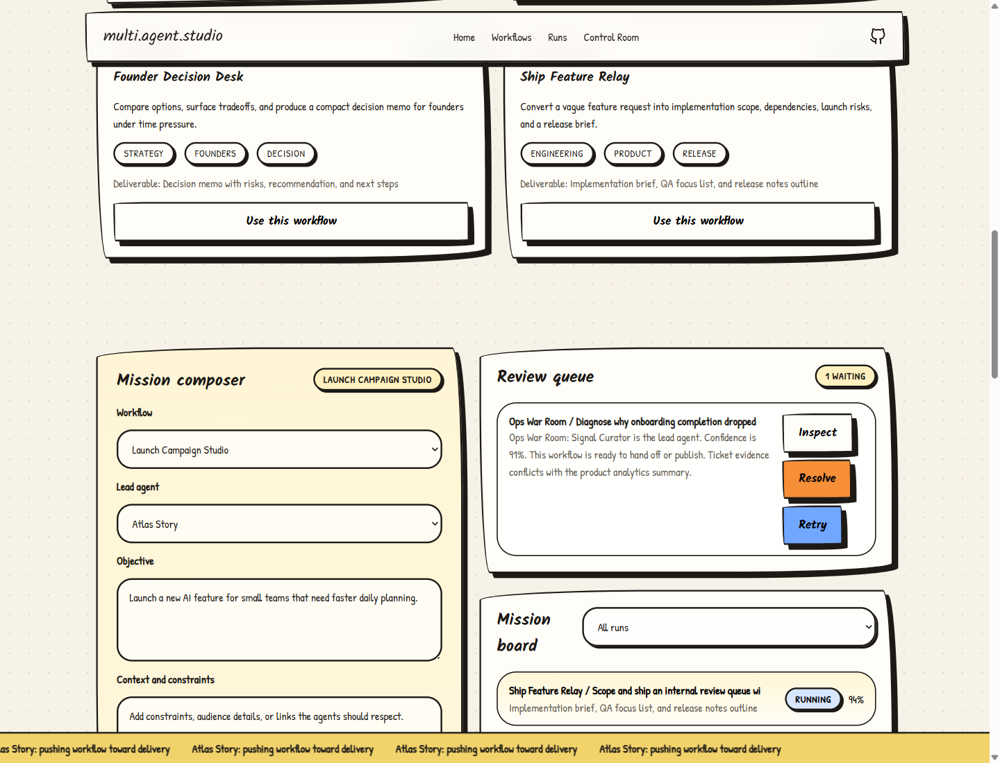
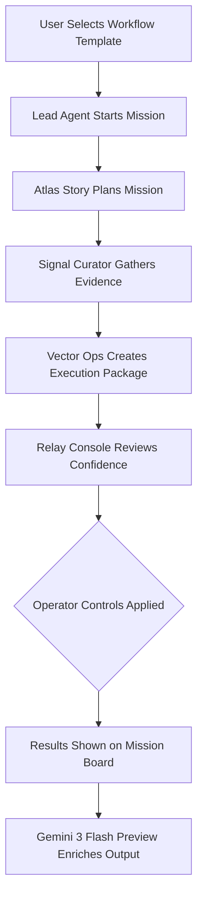

<div align="center">

<a href="https://git.io/typing-svg"></a>

<p align="center">
  
  
  
  
  
</p>

</div>

## Explore the Application

A fully functional Next.js multi agent system that elegantly turns one broad user request into a visible planner, researcher, builder, and reviewer workflow.

Live app: https://ai-agents-duel.vercel.app

GitHub: https://github.com/aniruddhaadak80/ai-agents-duel

This project was carefully rebuilt around the core ideas from the DEV Education track on building multi agent systems. The primary focus is squarely on deep specialization, structured orchestration, explicit handoffs, and rigid review gates. Instead of one giant prompt, the app gives users an entire workflow library, precise agent controls, a visual review queue, and fully inspectable run details.

## Extensive Topics and Tags

Here is a look at the major themes covering this repository.
AI Agents, Build Multi Agents, Gemini 3 Flash, Nextjs, Vercel, Generative AI, Automation, LLM Orchestration, TypeScript Engineering, React 19, Human In The Loop, Agentic Workflows, Google AI Studio, Developer Tools.

## Visual Storyboard and Interface

Here is a look at the live dynamic application.



You can browse the expertly designed templates available right inside the Workflow Library.



The interactive Mission Board provides a brilliantly clear overview of your active tasks and specific agent assignments.



You can deeply inspect the exact output and internal thought process in the beautiful Run Detail view.



## Core System Features

Workflow first orchestration cleanly replaces a single ambiguous prompt box.
Multiple specialized agents operate natively with visible roles and real time status updates.
The integrated review queue comes fully featured with resolve and retry node actions.
Operator controls allow for intricate tuning of autonomy modes, publish targets, and escalation policies.
Robust sandbox tools are provided for deep queue pulse checks and agent duel stress testing.
The highly responsive sketchbook style UI flows flawlessly across both desktop and mobile screens.
The zero database structure guarantees incredibly fast local runs and instant Vercel deployments.

## Intelligent System Flowchart

Here is an architectural flowchart showing exactly how the system intelligently processes every single request.



## Running It Locally

First, securely install all the needed dependencies.

```bash
npm install
```

Next, easily create a local env file if you want powerful Gemini powered enrichment.

```bash
copy .env.example .env.local
```

Then, quietly start the dev server.

```bash
npm run dev
```

Finally, open your preferred browser directly to `http://localhost:3000` to see it perfectly running.

## Environment Architecture

The specific `GEMINI_API_KEY` is not required but it gracefully enables Gemini enrichment for generated run output.
If the key remains naturally missing, the application completely works smoothly using the integrated local multi agent orchestration engine fallback.

## Behind The Orchestration Engine

The application actively utilizes four fixed permanent roles.
Atlas Story plans the mission and frames the core deliverable.
Signal Curator actively gathers evidence along with tensions and contradictions.
Vector Ops heavily turns the plan into a tangible execution package.
Relay Console precisely reviews overall confidence, project risk, and true operator readiness.

A run logically follows a wonderfully clear path.
First, the user dynamically selects a workflow template.
Second, a lead agent properly starts the designated workflow.
Third, the internal store beautifully expands the objective into distinct stages, contributions, rich artifacts, and valuable recommendations.
Fourth, advanced operator controls manipulate absolute confidence, review gating, and publish behavior.
Fifth, the final result is immediately shown on the responsive mission board and active review queue.
Finally, if Gemini is properly configured, the chosen agent optimally enriches the completely final output using the network.
