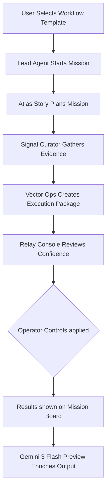

# Multi Agent Studio

A fully functional Next.js multi agent system that turns one broad user request into a visible planner, researcher, builder, and reviewer workflow.

Live app: https://ai-agents-duel.vercel.app

GitHub: https://github.com/aniruddhaadak80/ai-agents-duel

This project was rebuilt around the core ideas from the DEV Education track on building multi agent systems. The focus is on specialization, orchestration, explicit handoffs, and review gates. Instead of one giant prompt, the app gives users a workflow library, agent controls, a review queue, and inspectable run details.

## What the app does

Multi Agent Studio is aimed at users who need practical help turning fuzzy work into structured output.

It ships with four workflow templates.
1. Launch Campaign Studio
2. Ops War Room
3. Founder Decision Desk
4. Ship Feature Relay

Each run produces a workflow title and objective.
It also shows stage by stage ownership and agent contributions.
You can view deliverable artifacts, recommendations, and the operator brief.
It will show the review or completion state.

The app runs locally with an in memory orchestration engine.
It optionally upgrades itself with Gemini output when GEMINI_API_KEY is configured.

## Visual Overview

Here is a look at the live application.


You can browse the available templates in the Workflow Library.


The Mission Board provides a clear view of your active tasks and agent assignments.


You can inspect the exact output and thought process in the Run Detail view.


## Core features

1. Workflow first orchestration instead of a single prompt box.
2. Multiple specialized agents with visible roles and status.
3. Review queue with resolve and retry actions.
4. Operator controls for autonomy mode, publish target, and escalation policy.
5. Sandbox tools for queue pulse and agent duel stress testing.
6. Responsive sketchbook style UI that works on desktop and mobile.
7. Zero database setup for fast local runs and Vercel deployment.

## Tech stack

* 🚀 **Next.js 16** for the core framework.
* ⚛️ **React 19** for building user interfaces.
* 📘 **TypeScript** for static typing and safer code.
* 🎨 **Pure CSS** for styling without heavy libraries.
* 🧠 **@google/genai** using **gemini-3-flash-preview** for optional AI enrichment.
* ☁️ **Vercel** for seamless deployment.

## System Flowchart

Here is an interactive flowchart showing how the system processes a request.



## Local development

First, install dependencies.

```bash
npm install
```

Next, create a local env file if you want Gemini powered enrichment.

```bash
copy .env.example .env.local
```

Then, start the dev server.

```bash
npm run dev
```

Finally, open your browser to `http://localhost:3000`.

## Environment variables

The `GEMINI_API_KEY` is not required but it enables Gemini enrichment for generated run output.
If the key is missing, the app still works using the local multi agent orchestration engine.

## How the orchestration works

The app uses four fixed roles.
Atlas Story plans the mission and frames the deliverable.
Signal Curator gathers evidence, tensions, and contradictions.
Vector Ops turns the plan into an execution package.
Relay Console reviews confidence, risk, and operator readiness.

A run follows a clear shape.
First, the user selects a workflow template.
Second, a lead agent starts the workflow.
Third, the store expands the objective into stages, contributions, artifacts, and recommendations.
Fourth, operator controls influence confidence, review gating, and publish behavior.
Fifth, the result is shown in the mission board and review queue.
Finally, if Gemini is configured, the selected agent can enrich the final output.

## Project structure

- `src/components/agent-command-center.tsx`: the main interactive UI
- `src/lib/agent-duel/store.ts`: in-memory orchestration engine
- `src/lib/agent-duel/types.ts`: workflow, run, and control types
- `src/app/api/control-room`: route handlers for snapshot, run creation, controls, pulse, and duel

## Deploy to Vercel

1. Push this project to a GitHub repository.
2. Import the repository into Vercel.
3. Add `GEMINI_API_KEY` in the Vercel project settings if you want model enrichment.
4. Deploy.

Vercel does not need a database or extra build services for this version of the app.

## Push to GitHub

If this repository is already connected to Git, the standard sequence is:

```bash
git add .
git commit -m "Build workflow-driven multi-agent studio"
git push origin main
```

If you want to publish under a new repository:

```bash
git init
git add .
git commit -m "Initial commit"
git branch -M main
git remote add origin <your-repo-url>
git push -u origin main
```

## DEV post draft

A submission-ready draft is included at `docs/devto-submission.md`.

## Why this version is more useful

The previous build leaned heavily on presentation. This version is oriented around real operator behavior:

- faster onboarding through template workflows
- clear roles instead of vague agent theatrics
- visible review and retry mechanics
- inspectable deliverables for non-technical users
- optional model integration without making local setup fragile

## Next improvements

- Persist runs to a real database
- Stream live agent events over SSE or websockets
- Add user authentication and saved workspaces
- Connect real tool adapters for Slack, Notion, and Linear
